# Modelo UML de la base de datos — Agora

> Documento técnico del modelo de datos de Agora.  
> Fuente de verdad: `src/datos/esquema.ts`.

## 1. Alcance

El modelo de datos soporta:

- configuración institucional;
- años lectivos, jornadas, ciclos y periodos;
- áreas, asignaturas y planes académicos;
- aspirantes y procesos de matrícula;
- estudiantes, acudientes, docentes y usuarios;
- asignación docente y evaluación académica;
- cartera, caja, egresos y nómina;
- archivos y documentos generados;
- auditoría, control de acceso y limitación de solicitudes;
- autenticación mediante Better Auth;
- contenido institucional administrable mediante CMS.

Los diagramas se dividen por dominios funcionales para facilitar su lectura. Las entidades que participan en más de un dominio pueden aparecer en más de un diagrama.

---

## 2. Perfiles funcionales

La plataforma contempla los siguientes perfiles:

1. Profesor
2. Estudiante
3. Acudiente
4. Secretaría
5. Administrador
6. Superadministrador
7. Contador

Actualmente, el perfil principal se almacena en:

```text
USUARIO.rol
```

| Perfil funcional | Valor técnico documentado |
|---|---|
| Profesor | `profesor` |
| Estudiante | `estudiante` |
| Acudiente | `acudiente` |
| Secretaría | `secretaria` |
| Administrador | `administrador` |
| Superadministrador | `superadmin` |
| Contador | `contador` |

> El esquema actual utiliza un único campo de texto para representar el rol principal. No existen todavía las entidades `ROL`, `PERMISO` ni `USUARIO_ROL`. Si se requiere asignar múltiples perfiles a una misma persona, deberá diseñarse posteriormente un modelo RBAC formal.

---

## 3. Convenciones del modelo

| Símbolo | Significado |
|---|---|
| `PK` | Clave primaria |
| `FK` | Clave foránea |
| `UK` | Restricción de unicidad |
| `||--o{` | Una entidad se relaciona con cero o muchos registros |
| `||--o|` | Una entidad se relaciona con cero o un registro |

Las relaciones dibujadas representan relaciones declaradas en el esquema mediante claves foráneas, salvo cuando una observación indique expresamente que se trata de una relación lógica.

---

# 4. Configuración institucional y estructura académica

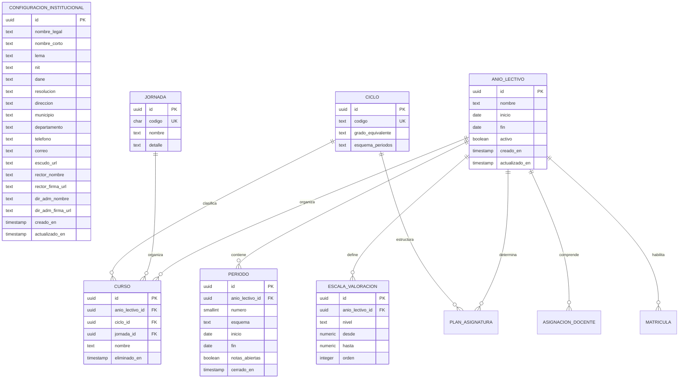

---

# 5. Plan académico

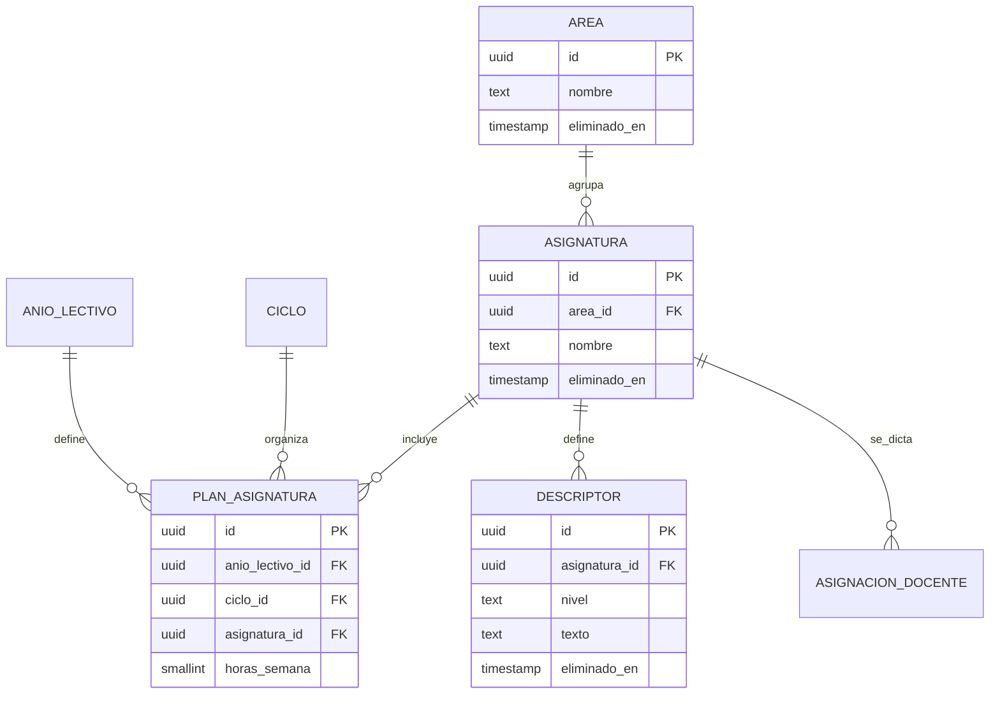

---

# 6. Personas, perfiles operativos y relaciones familiares

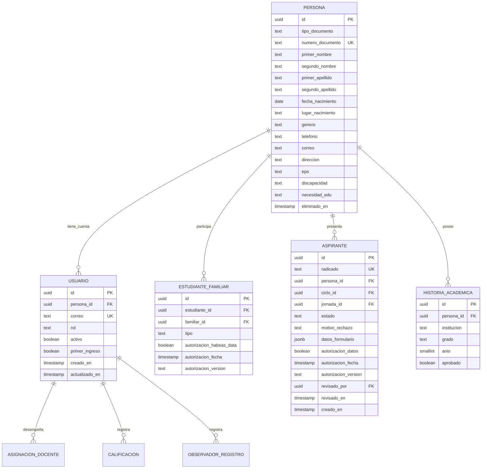

> `ESTUDIANTE_FAMILIAR` utiliza dos referencias hacia `PERSONA`: una representa al estudiante y otra al acudiente o familiar. Mermaid las muestra como una relación conceptual única; los roles concretos están determinados por `estudiante_id` y `familiar_id`.

---

# 7. Aspirantes y matrícula

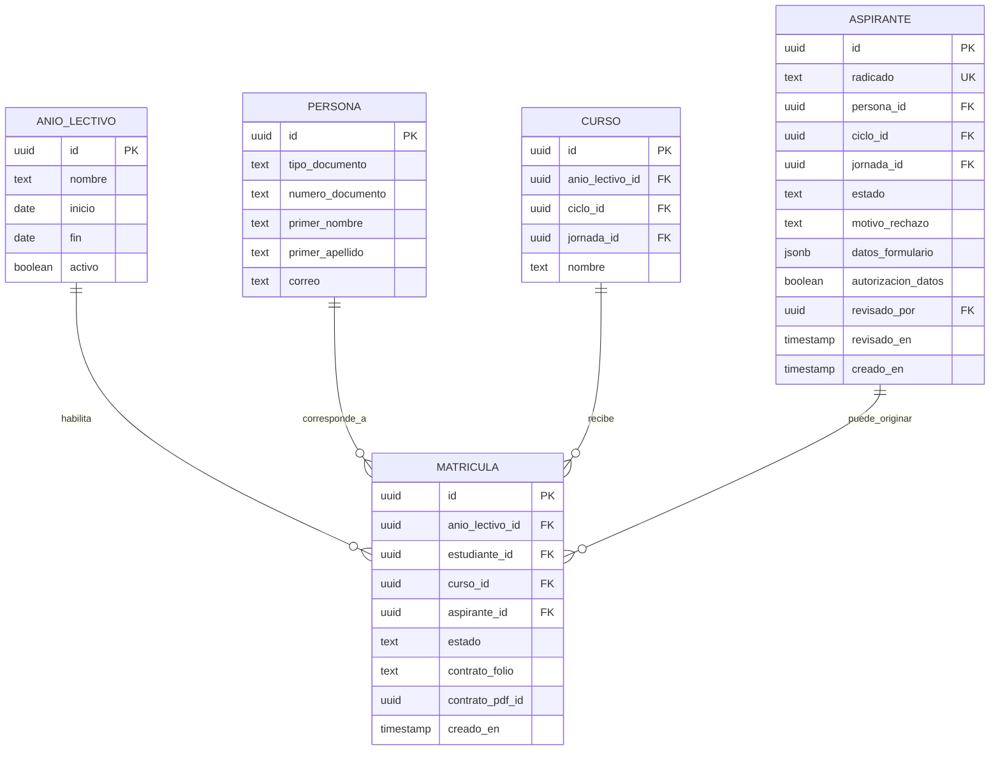

> `matricula.estudiante_id` apunta a `persona.id`, porque una persona puede desempeñar el rol de estudiante. `contrato_pdf_id` es una referencia lógica y actualmente no tiene una FK declarada hacia `archivo.id`.

---

# 8. Docencia, calificaciones y seguimiento académico

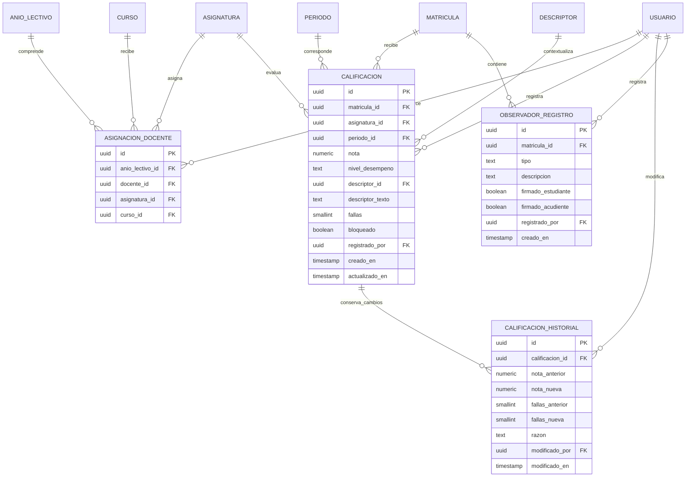

> `calificacion.descriptor_texto` conserva una copia textual del descriptor utilizado, incluso si posteriormente el descriptor original es modificado o eliminado.

---

# 9. Finanzas, cartera y caja

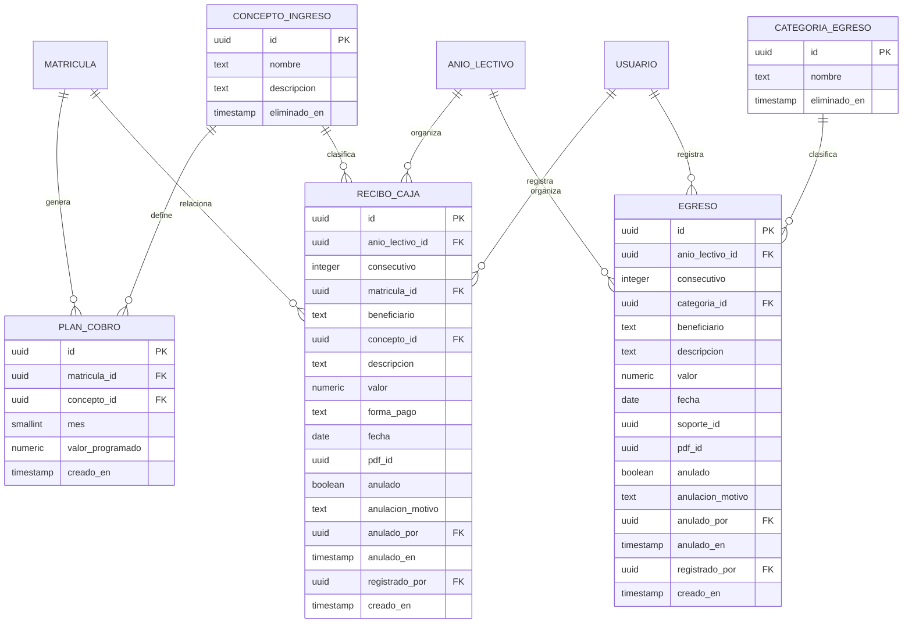

> `recibo_caja.pdf_id`, `egreso.soporte_id` y `egreso.pdf_id` son referencias lógicas a archivos o documentos. El esquema actual no declara FK directa para estas columnas.

---

# 10. Nómina y caja menor

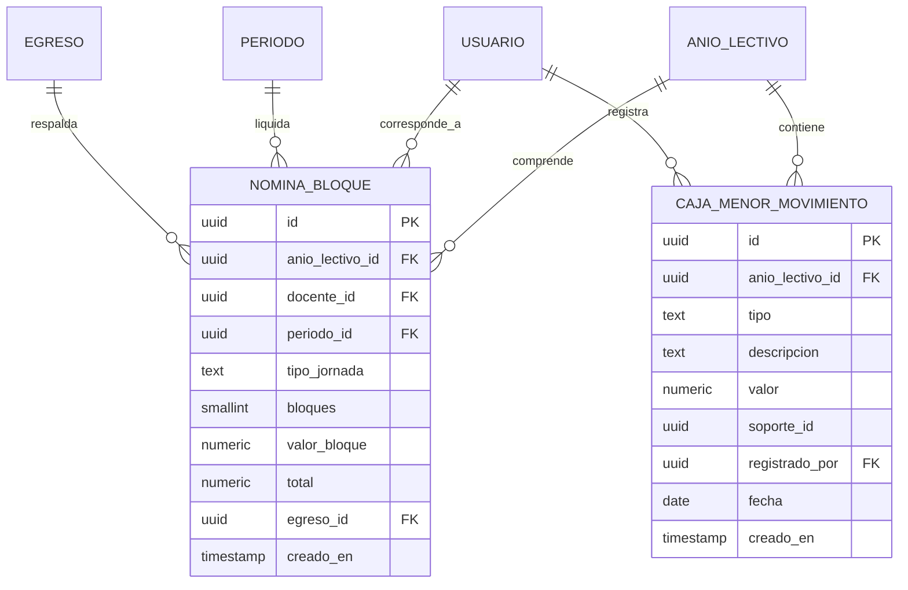

---

# 11. Archivos y documentos generados

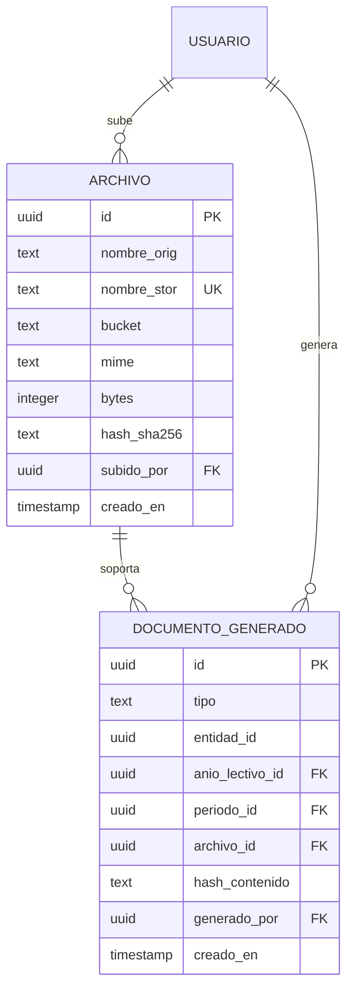

> `documento_generado.entidad_id` es una referencia polimórfica: identifica registros pertenecientes a distintas entidades según el valor de `tipo`. Por esa razón no tiene una FK única declarada.

---

# 12. CMS institucional

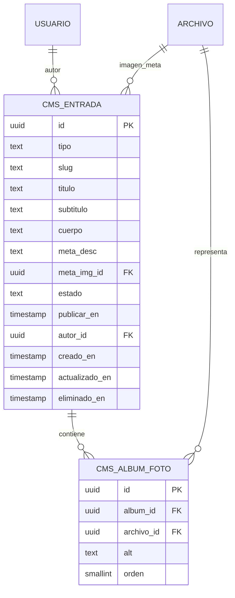

---

# 13. Auditoría, control y secuencias

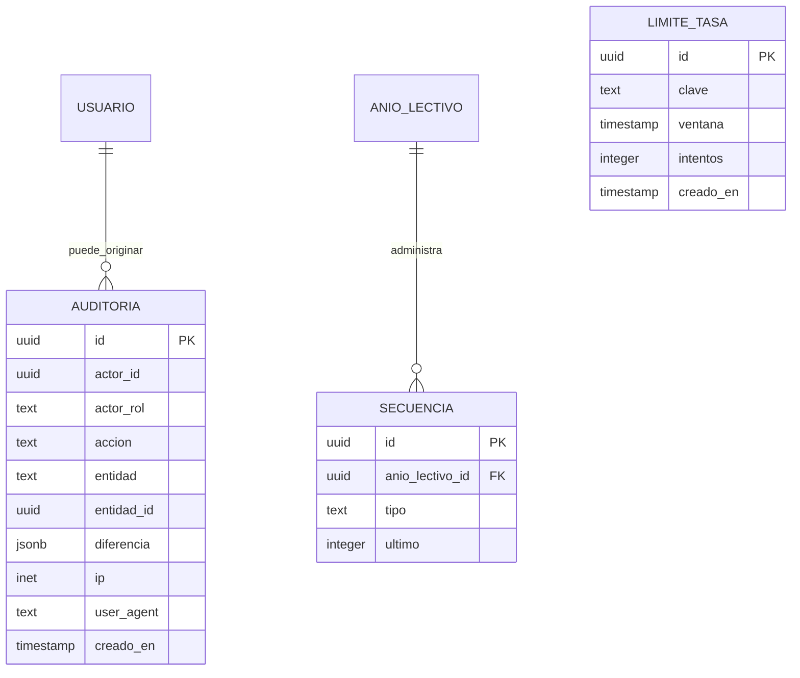

> `auditoria.actor_id` identifica al actor de la operación, pero actualmente no tiene una FK declarada hacia `usuario.id`.  
> `auditoria.entidad_id` también es una referencia polimórfica y depende del valor de `entidad`.

---

# 14. Autenticación con Better Auth

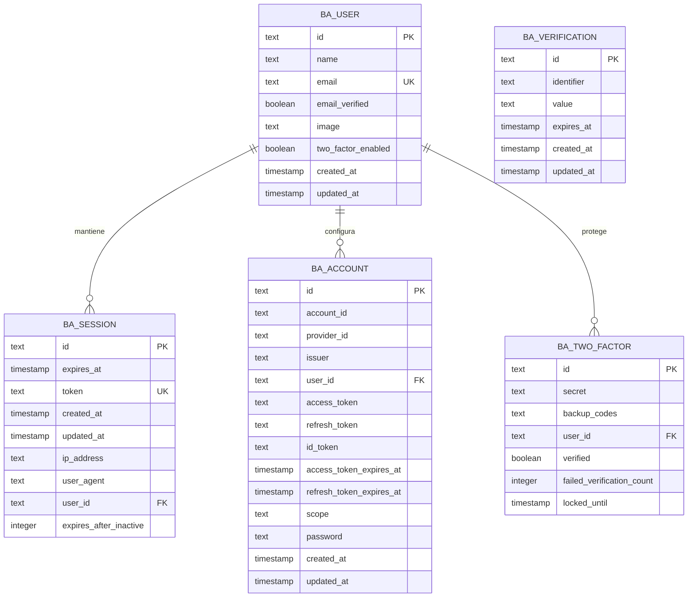

> `BA_USER` y `USUARIO` representan conceptos diferentes. `BA_USER` pertenece al mecanismo de autenticación de Better Auth; `USUARIO` representa la cuenta operativa de Agora. El esquema actual no declara una FK directa entre ambas tablas.

---

# 15. Inventario de entidades

## Institución y academia

- `configuracion_institucional`
- `anio_lectivo`
- `jornada`
- `ciclo`
- `escala_valoracion`
- `periodo`
- `area`
- `asignatura`
- `plan_asignatura`
- `curso`
- `descriptor`

## Personas y operación académica

- `persona`
- `usuario`
- `estudiante_familiar`
- `aspirante`
- `matricula`
- `historia_academica`
- `asignacion_docente`
- `calificacion`
- `calificacion_historial`
- `observador_registro`

## Finanzas

- `concepto_ingreso`
- `plan_cobro`
- `recibo_caja`
- `categoria_egreso`
- `egreso`
- `nomina_bloque`
- `caja_menor_movimiento`
- `secuencia`

## Archivos y contenido

- `archivo`
- `documento_generado`
- `cms_entrada`
- `cms_album_foto`

## Seguridad e infraestructura

- `auditoria`
- `limite_tasa`
- `ba_user`
- `ba_session`
- `ba_account`
- `ba_verification`
- `ba_two_factor`

---

# 16. Consideraciones de diseño

1. `persona` centraliza la identidad de estudiantes, acudientes, docentes y personal administrativo.
2. `usuario` vincula una persona con las capacidades operativas de la plataforma.
3. `usuario.rol` representa actualmente un único perfil principal.
4. `estudiante_familiar` permite modelar relaciones entre estudiantes y acudientes.
5. `matricula` conecta un estudiante con un año lectivo y un curso.
6. `calificacion` se identifica funcionalmente por matrícula, asignatura y periodo.
7. `calificacion_historial` proporciona trazabilidad de modificaciones sobre las notas.
8. `documento_generado.entidad_id` y `auditoria.entidad_id` son referencias polimórficas.
9. Las columnas `pdf_id`, `soporte_id` y `contrato_pdf_id` son referencias lógicas sin FK explícita hacia `archivo`.
10. Better Auth mantiene su propio conjunto de tablas de autenticación.
11. Las tablas de autenticación no deben confundirse con las tablas operativas de Agora.
12. La separación entre roles funcionales y autenticación permite evolucionar posteriormente hacia un modelo de permisos más granular.

---

# 17. Estado del modelo

Este documento refleja la estructura actualmente declarada en:

```text
src/datos/esquema.ts
```

Cualquier cambio futuro en tablas, columnas, claves foráneas, roles o permisos deberá actualizar simultáneamente:

- el esquema Drizzle;
- las migraciones;
- este documento UML;
- las políticas de autorización;
- la documentación funcional correspondiente.